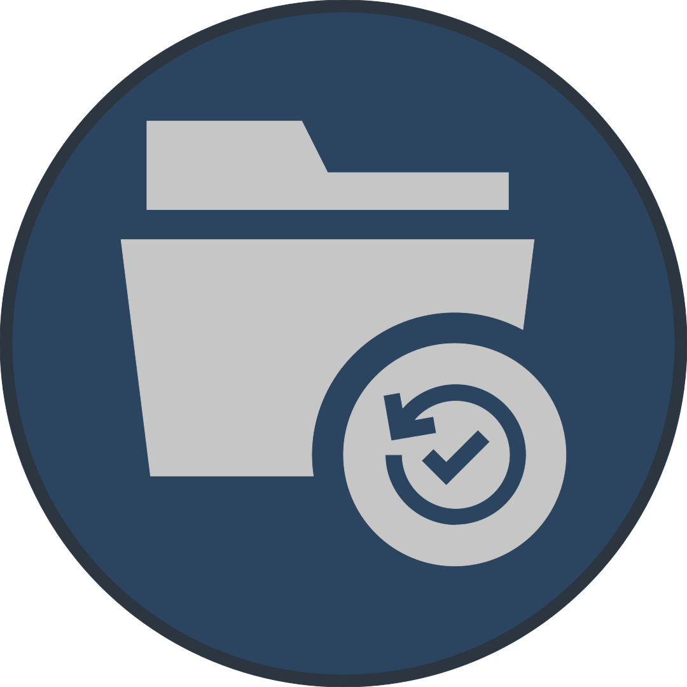

<h1 align="center">
  <a href="https://github.com/Albin-Xavier/PS-Backup-Safely">
    
  </a>
</h1>

<div align="center">
  Backup-Safely
  <br />
  <a href="#about"><strong>Explore the docs »</strong></a>
  <br />
  <br />
  <a href="https://github.com/Albin-Xavier/PS-Backup-Safely/issues/new?assignees=&labels=bug&template=01_BUG_REPORT.md&title=bug%3A+">Report a Bug</a>
  ·
  <a href="https://github.com/Albin-Xavier/PS-Backup-Safely/issues/new?assignees=&labels=enhancement&template=02_FEATURE_REQUEST.md&title=feat%3A+">Request a Feature</a>
  .
  <a href="https://github.com/Albin-Xavier/PS-Backup-Safely/issues/new?assignees=&labels=question&template=04_SUPPORT_QUESTION.md&title=support%3A+">Ask a Question</a>
</div>

<div align="center">
<br />

[](LICENSE)
[](https://github.com/Albin-Xavier/PS-Backup-Safely/issues?q=is%3Aissue+is%3Aopen+label%3A%22help+wanted%22)

</div>

<details open="open">
<summary>Table of Contents</summary>

- [About](#about)
  - [Built With](#built-with)
- [Getting Started](#getting-started)
  - [Prerequisites](#prerequisites)
  - [Installation](#installation)
- [Usage](#usage)
- [Roadmap](#roadmap)
- [Support](#support)
- [Contributing](#contributing)
- [Authors & contributors](#authors--contributors)
- [License](#license)
- [Acknowledgements](#acknowledgements)

</details>

---

## About

This PowerShell script will back up folders on a Windows system using Robocopy. If you have ever forgotten in the past to back up important folders and subsequently lost them, this script aims to help. It reads from a list of folders contained in a file. It then copies those folders and their contents to the folder the script is running in as a backup. With a bit of work using the task scheduler in Windows, this could be set up to run automatically at preset times, such as every day at 8:00 AM, for example. Since it uses Robocopy, it provides fast, safe backups that easily run in bulk.

### Built With

- [PowerShell 7](https://github.com/PowerShell/PowerShell) - Scripting Language
- [Visual Studio Code](https://code.visualstudio.com/) - Script Writing
- [PowerShell Extension for Visual Studio Code](https://github.com/PowerShell/vscode-powershell) - Script Writing, Debugging
- [Affinity Photo](https://affinity.serif.com/en-us/photo/) - Media Creation

## Getting Started

### Prerequisites

- A computer running Microsoft Windows.

- Windows PowerShell 5.1 should already be installed on your computer. That will work just fine, but the menu to add folders will work better with PowerShell 7, which has a download link provided above.

- The PowerShell module [PSMenu](https://github.com/Sebazzz/PSMenu). To install PSMenu, open PowerShell and use the following command:

```powershell
Install-Module PSMenu -Scope CurrentUser
```

### Installation

Download the latest release from the [Releases] section. Extract the provided .zip file into any folder you like.
Once the release is extracted, right-click on the file "New-Launcher.ps1" to generate shortcuts to launch the remaining scripts more easily. Once the shortcuts have been generated, it is ready to go!

**Note:** Please do not relocate the scripts after generating shortcuts. This will cause the shortcuts to break. To fix this, run "New-Launcher.ps1" again using the same method as before to regenerate the shortcuts.

## Usage

First, add folders to be backed up using the shortcut titled "Edit-List". Then, follow the on-screen instructions in the newly-opened menu to add a folder to the folder list. When done, press escape or close the window to exit the editor.

Once folders have been added, run the shortcut titled "Backup-Safely" to start the backup. It will then back up all the folders listed in the Folders.txt file. This file is what Edit-List add or removes folder paths from. Take care and enjoy!

## Roadmap

See the [open issues](https://github.com/Albin-Xavier/PS-Backup-Safely/issues) for a list of proposed features (and known issues).

- [Top Feature Requests](https://github.com/Albin-Xavier/PS-Backup-Safely/issues?q=label%3Aenhancement+is%3Aopen+sort%3Areactions-%2B1-desc) (Add your votes using the 👍 reaction)
- [Top Bugs](https://github.com/Albin-Xavier/PS-Backup-Safely/issues?q=is%3Aissue+is%3Aopen+label%3Abug+sort%3Areactions-%2B1-desc) (Add your votes using the 👍 reaction)
- [Newest Bugs](https://github.com/Albin-Xavier/PS-Backup-Safely/issues?q=is%3Aopen+is%3Aissue+label%3Abug)

## Support

Reach out to the maintainer at one of the following places:

- [GitHub issues](https://github.com/Albin-Xavier/PS-Backup-Safely/issues/new?assignees=&labels=question&template=04_SUPPORT_QUESTION.md&title=support%3A+)
- Contact options listed on [this GitHub profile](https://github.com/Albin-Xavier)


## Contributing

First off, thanks for taking the time to contribute! Contributions are what make the open-source community such an amazing place to learn, inspire, and create. Any contributions you make will benefit everybody else and are **greatly appreciated**.


Please read [our contribution guidelines](docs/CONTRIBUTING.md), and thank you for being involved!

## Authors & contributors

The original setup of this repository is by [Albin](https://github.com/Albin-Xavier).

For a full list of all authors and contributors, see [the contributors page](https://github.com/Albin-Xavier/PS-Backup-Safely/contributors).


## License

This project is licensed under the **MIT license**.

See [LICENSE](LICENSE) for more information.

## Acknowledgements

- Photo Album by Icon 54 from the [Noun Project](https://thenounproject.com/browse/icons/term/photo-album/) - Icon for logo.
- [Learn PowerShell in a Month of Lunches](https://www.manning.com/books/learn-powershell-in-a-month-of-lunches), by Travis Plunk, James Petty, Tyler Leonhardt, Don Jones, and Jeffery Hicks - Main resource for learning PowerShell.
